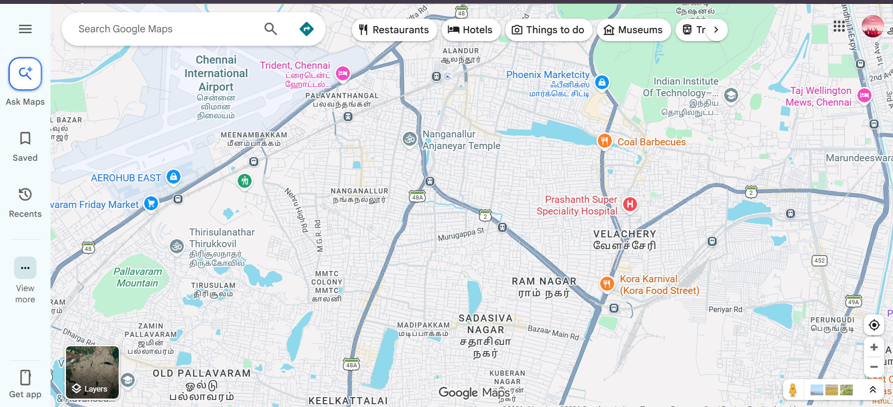
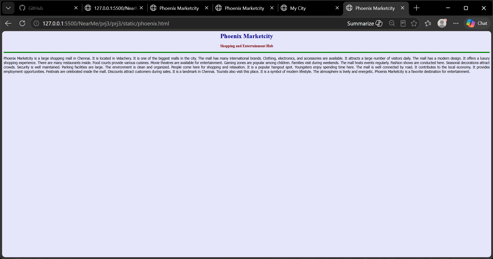
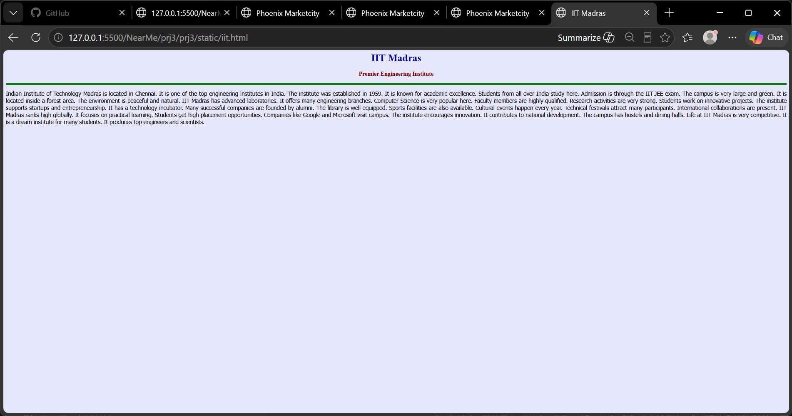
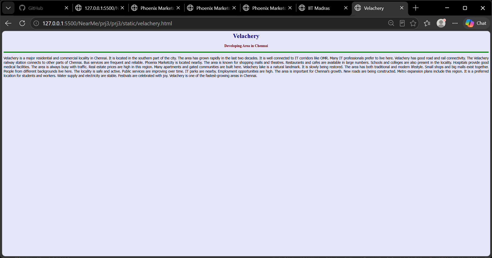

# Ex03 Places Around Me
## Date: 

## AIM
To develop a website to display details about the places around my house.

## DESIGN STEPS

### STEP 1
Create a Django admin interface.

### STEP 2
Download your city map from Google.

### STEP 3
Using ```<map>``` tag name the map.

### STEP 4
Create clickable regions in the image using ```<area>``` tag.

### STEP 5
Write HTML programs for all the regions identified.

### STEP 6
Execute the programs and publish them.

## CODE
```<html>
<head>
<title>My City</title>
</head>

<body>

<h1 align="center">
<font color="red"><b>velachery</b></font>
</h1>

<h3 align="center">
<font color="blue">
<b>Vinodharani V (212225040491)<</b>
</font>
</h3>

<center>



<map name="MyCity">

<area shape="rect" coords="7" href="iit.html" title="IIT">
<area shape="circle" coords="100,100,800,800" href="phoenix.html" title="PHEONIX MALL">
<area shape="circle" coords="640,200,30" href="velachery.html" title="Velacher city">


</map>

</center>

</body>
</html>

IIT

<html>
<head>
<title>IIT Madras</title>
</head>

<body bgcolor="lavender">

<h1 align="center"><font color="darkblue"><b>IIT Madras</b></font></h1>
<h3 align="center"><font color="maroon"><b>Premier Engineering Institute</b></font></h3>

<hr size="4" color="green">

<p align="justify">
<font face="Tahoma" size="4">

Indian Institute of Technology Madras is located in Chennai. It is one of the top engineering institutes in India. The institute was established in 1959. It is known for academic excellence. Students from all over India study here. Admission is through the IIT-JEE exam. The campus is very large and green. It is located inside a forest area. The environment is peaceful and natural. IIT Madras has advanced laboratories. It offers many engineering branches. Computer Science is very popular here. Faculty members are highly qualified. Research activities are very strong. Students work on innovative projects. The institute supports startups and entrepreneurship. It has a technology incubator. Many successful companies are founded by alumni. The library is well equipped. Sports facilities are also available. Cultural events happen every year. Technical festivals attract many participants. International collaborations are present. IIT Madras ranks high globally. It focuses on practical learning. Students get high placement opportunities. Companies like Google and Microsoft visit campus. The institute encourages innovation. It contributes to national development. The campus has hostels and dining halls. Life at IIT Madras is very competitive. It is a dream institute for many students. It produces top engineers and scientists.

</font>
</p>

</body>
</html>

<html>
<head>
<title>Phoenix Marketcity</title>
</head>

<body bgcolor="lavender">

<h1 align="center"><font color="darkblue"><b>Phoenix Marketcity</b></font></h1>
<h3 align="center"><font color="maroon"><b>Shopping and Entertainment Hub</b></font></h3>

<hr size="4" color="green">

<p align="justify">
<font face="Tahoma" size="4">

Phoenix Marketcity is a large shopping mall in Chennai. It is located in Velachery. It is one of the biggest malls in the city. The mall has many international brands. Clothing, electronics, and accessories are available. It attracts a large number of visitors daily. The mall has a modern design. It offers a luxury shopping experience. There are many restaurants inside. Food courts provide various cuisines. Movie theatres are available for entertainment. Gaming zones are popular among children. Families visit during weekends. The mall hosts events regularly. Fashion shows are conducted here. Seasonal decorations attract crowds. Security is well maintained. Parking facilities are large. The environment is clean and organized. People come here for shopping and relaxation. It is a popular hangout spot. Youngsters enjoy spending time here. The mall is well connected by road. It contributes to the local economy. It provides employment opportunities. Festivals are celebrated inside the mall. Discounts attract customers during sales. It is a landmark in Chennai. Tourists also visit this place. It is a symbol of modern lifestyle. The atmosphere is lively and energetic. Phoenix Marketcity is a favorite destination for entertainment.

</font>
</p>

</body>
</html>

<html>
<head>
<title>Phoenix Marketcity</title>
</head>

<body bgcolor="lavender">

<h1 align="center"><font color="darkblue"><b>Phoenix Marketcity</b></font></h1>
<h3 align="center"><font color="maroon"><b>Shopping and Entertainment Hub</b></font></h3>

<hr size="4" color="green">

<p align="justify">
<font face="Tahoma" size="4">

Phoenix Marketcity is a large shopping mall in Chennai. It is located in Velachery. It is one of the biggest malls in the city. The mall has many international brands. Clothing, electronics, and accessories are available. It attracts a large number of visitors daily. The mall has a modern design. It offers a luxury shopping experience. There are many restaurants inside. Food courts provide various cuisines. Movie theatres are available for entertainment. Gaming zones are popular among children. Families visit during weekends. The mall hosts events regularly. Fashion shows are conducted here. Seasonal decorations attract crowds. Security is well maintained. Parking facilities are large. The environment is clean and organized. People come here for shopping and relaxation. It is a popular hangout spot. Youngsters enjoy spending time here. The mall is well connected by road. It contributes to the local economy. It provides employment opportunities. Festivals are celebrated inside the mall. Discounts attract customers during sales. It is a landmark in Chennai. Tourists also visit this place. It is a symbol of modern lifestyle. The atmosphere is lively and energetic. Phoenix Marketcity is a favorite destination for entertainment.

</font>
</p>

</body>
</html>
```


## OUTPUT









## RESULT
The program for implementing image maps using HTML is executed successfully.
